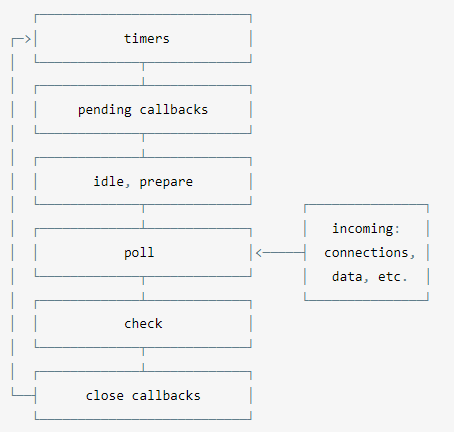

# 欢迎进入Node.js的世界
Node.js是一个JavaScript运行平台，其显著特征是它的异步和事件驱动机制，以及小巧精悍的标准库。  
大体上来说，Node和JavaScript的优势之一是它们的单线程编程模型。

## 非阻塞I/O
大概意思是说，你的程序可以在做其他事情时发起一个请求来获取网络资源，然后当网络操作完成时，将会运行一个回调函数来处理这个操作的结果。  
在进行速度较慢（访问磁盘、网络请求等）的处理时让Node能做其他事情，是使用带非阻塞I/O的异步API真正的好处。

## 事件轮询
事件循环是 Node.js 处理非阻塞 I/O 操作的机制——尽管 JavaScript 是单线程处理的——当有可能的时候，它们会把操作转移到系统内核中去。  
既然目前大多数内核都是多线程的，它们可在后台处理多种操作。当其中的一个操作完成的时候，内核通知 Node.js 将适合的回调函数添加到轮询队列中等待时机执行。  
当 Node.js 启动后，它会初始化事件轮询；处理已提供的输入脚本，它可能会调用一些异步的 API、调度定时器，或者调用 process.nextTick()，然后开始处理事件循环。 

  

每个阶段都有一个 FIFO 队列来执行回调。虽然每个阶段都是特殊的，但通常情况下，当事件循环进入给定的阶段时，它将执行特定于该阶段的任何操作，然后执行该阶段队列中的回调，直到队列用尽或最大回调数已执行。当该队列已用尽或达到回调限制，事件循环将移动到下一阶段，等等。  
[Node.js 事件轮询，定时器和 process.nextTick()详解](https://www.bookstack.cn/read/nodejs-guide/590a0c76ccf949ba.md)